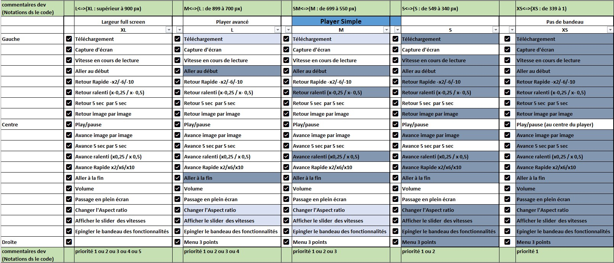
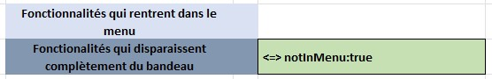
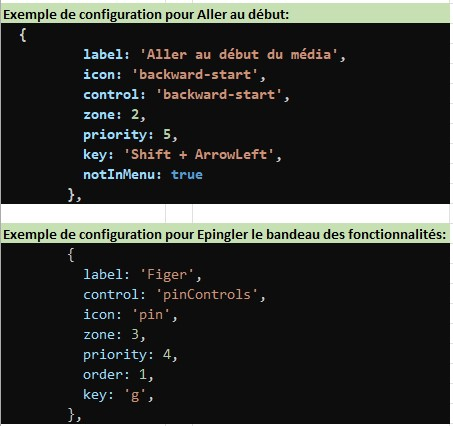
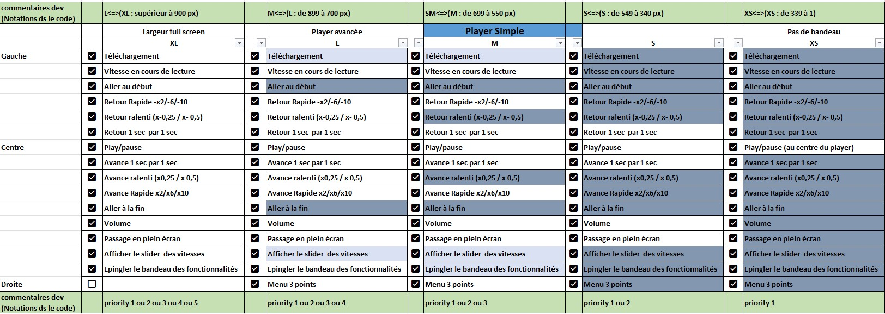
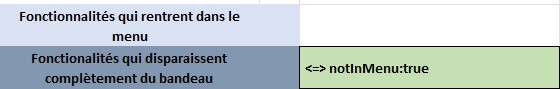

# Amalia (`@ina/amalia`)

Amalia is an extensible and versatile HTML5 multimedia player that can display rich metadata alongside video or audio streams. It follows the responsive design guidelines.

Amalia is composed of three main parts:
- the core player
- the unified metadata format
- the visualization plugins

## What this repository provides

This project is an Angular-based player packaged primarily as **Web Components (Angular Elements)**. It exposes:
- a main player custom element: `amalia-player`
- multiple plugin custom elements (timelines, annotations, subtitles, transcriptions, histograms,etc.)

Most components use **Shadow DOM encapsulation**, which makes them easy to embed in host applications while keeping styles isolated.

## Prerequisites

- Node.js / npm (see the project constraints in `package.json`)

Install dependencies:

```sh
npm install
```

## Development

Start the dev server:

```sh
npm start
```

Then open:

- http://localhost:4202/

## Running examples

Start a static server to view samples:

```sh
npm run start-examples
```

Then open:

- http://localhost:4203/

> [!NOTE]
> The samples are yet to be fixed in an upcoming release.

## Architecture overview (high level)

### Web Components bootstrap

The Angular module registers several custom elements (Angular Elements). There is no “classic” Angular app bootstrap; the module defines custom elements in `ngDoBootstrap()`.

Custom elements include:
- `amalia-player`
- `amalia-time-bar`
- `amalia-control-bar`
- `amalia-transcription`
- `amalia-subtitles`
- `amalia-storyboard`
- `amalia-histogram`
- `amalia-timeline`
- `amalia-annotation`

### Core runtime object: `MediaPlayerElement`

Each player instance is driven by a `MediaPlayerElement`, which orchestrates:
- configuration loading (core + plugins configuration)
- metadata loading and parsing
- media element wiring (HTML `<video>` / `<audio>`)
- event emission (`PlayerEventType`)

A `MediaPlayerService` maintains a map of `playerId -> MediaPlayerElement`, allowing multiple components (player + plugins) to share the same underlying instance.

### Plugin system

Plugins are built on a common base class (`PluginBase<T>`). A plugin typically:
- receives a `playerId`
- retrieves the corresponding `MediaPlayerElement`
- merges configuration from:
  - plugin default config
  - configuration loaded from the global player config
  - optional configuration passed directly as an attribute/input

Plugins subscribe to player events and can initialize once the player is ready.

## Configuration & metadata

### Core configuration

The player is driven by a configuration object (`ConfigData`) which can define:
- `player` settings (source, ratio, framerate, etc.)
- `dataSources` (metadata endpoints)
- `pluginsConfiguration`
- `loadMetadataOnDemand` (load metadata only when a plugin requests it)
- thumbnail options
- debug/logLevel settings
- display size breakpoints (breakpoints are used to define the size of the player based on the screen size)

### Plugin configuration

Plugin configuration is defined in the `pluginsConfiguration` object of the `ConfigData`.

Video player configuration:
 

 

 

Audio player configuration:
 

 

 

### Metadata loading

Metadata are managed by `MetadataManager` and stored by id.
Data sources are declared in config; each data source can specify:
- a URL
- optional HTTP headers (including Authorization)
- optionally, a plugin target

When `loadMetadataOnDemand` is enabled, metadata can be fetched per plugin rather than upfront.

### Authorization refresh

`MetadataManager` includes logic to update Authorization headers (Bearer token) for scenarios where plugins need to re-fetch metadata and the token must be refreshed.

## Player Expert integration (reference)

This section documents the real-world integration used by the **Player Expert** application. A more complete guide is available here:
See [PLAYER_EXPERT_INTEGRATION.md](./docs/PLAYER_EXPERT_INTEGRATION.md)

### Distribution model: one bundled JS file

Player Expert does not import Amalia as an ES module in the Angular build. Instead it loads a single, pre-built bundle at runtime:

- **Expected consumer asset**: `assets/amalia-<version>.min.js`

In Amalia, this bundle is produced by `npm run build:component` / `npm run build` and lands in:

- `dist/amalia/amalia-<version>.min.js`

### Runtime script injection

In Player Expert, the bundle is injected once (idempotent) by looking for an existing script tag:

- `script[src="assets/amalia-<version>.min.js"]`

If missing, the app creates a `<script type="module" src="assets/amalia-<version>.min.js">` and appends it to the document.

### Web Components created by the host

Player Expert creates and configures custom elements programmatically:

- `amalia-player` with attributes:
  - `player-id`
  - `id="ajs-<playerId>"`
  - `type="video" | "audio"`
  - `config="<JSON>"` (stringified configuration)
- child element:
  - `amalia-control-bar` with `player-id`

Plugins are created as separate custom elements and attached into the host layout containers (e.g. timeline, transcription, subtitles, storyboard, histogram, time-bar, annotation).

### Configuration highlights used in Player Expert

Player Expert builds a configuration object (video or audio) and passes it via the `config` attribute.

Common settings:

- `player.src`
- `player.backwardsSrc` (optional)
- `player.hls.config.startPosition` (start time)
- `player.ratio` (video)
- `thumbnail.baseUrl` (thumbnails)
- `loadMetadataOnDemand = true`
- `dataSources = []` (built dynamically based on enabled plugins)

### Metadata URLs and plugin routing conventions

Player Expert builds metadata URLs and associates them to a plugin key (timeline, annotations, transcription, subtitles, etc.). A common convention is to include:

- `format=AMALIA` or `format=amalia-mot`
- `plugin=<PLUGIN_NAME>` (e.g. `TIMELINE`, `ANNOTATION`)
- `clientId=<id>` (used to distinguish/namespace a datasource per plugin instance)

Examples observed in Player Expert:

- Timelines (Flux):
  - `/segments/flux?channel=<channel>&startDate=<from>&endDate=<to>&format=AMALIA&plugin=TIMELINE&clientId=timelines`
- Timelines (Stock):
  - `/segments/stock?itemBusinessIdentifier=<id>&tcin=<tcIn>&tcout=<tcOut>&format=AMALIA&plugin=TIMELINE&clientId=timelines`
- Annotations:
  - `/segments/flux?...&format=AMALIA&plugin=ANNOTATION&clientId=annotations`
  - `/segments/stock?...&format=AMALIA&plugin=ANNOTATION&clientId=annotations`
- LDD plugin search endpoints (subtitles/transcriptions/faces recognition/sound segments):
  - `/search/plugin?pluginName=subtitles&format=amalia-mot&clientId=subtitles<...>`
  - `/search/plugin?pluginName=transcriptions&format=amalia-mot&clientId=transcription-<algo><...>&algoname=<algo>`
- Documents liés → Timelines datasource:
  - `/px/item/instances-segments?item=<businessId>&tcin=<...>&tcout=<...>&clientId=DOCUMENTS_LIES-`

### Authorization headers

Player Expert sets Authorization headers on Amalia data sources using:

- `Authorization: Bearer <token>`

Some endpoints are requested with:

- `Accept: application/x-msgpack`

See `MetadataManager` authorization refresh for long-lived sessions.

## Icons (SVG sprite)

This project generates an SVG sprite for icons.

Build icons:

```sh
npm run build:icon
```

## Tests (unit tests + coverage)

Run once (headless, with coverage):

```sh
npm test
```

Watch mode:

```sh
npm run test-watch
```

## Lint

```sh
npm run lint
```

## Build

This project builds:
- the Angular output under `dist/`
- a packaged output under `dist/amalia`

Build everything (lint + icons + component build):

```sh
npm run build
```

### Web Component bundle

After the Angular build, a helper script concatenates:
- `dist/amalia/runtime.js`
- `dist/amalia/polyfills.js`
- `dist/amalia/scripts.js`
- `dist/amalia/main.js`

into:

- `dist/amalia/amalia-<version>.min.js`

## Publishing

Publishing uses `package-public.json` as the package manifest for the published artifact.

Publish:

```sh
npm run publish
```

## E2E

The repo provides:

```sh
npm run e2e
```

Note: the actual E2E runner/setup depends on the workspace configuration. If `ng e2e` is not configured in your environment, you may need to add/configure an E2E solution.

## Documentation generation

Generate TypeDoc HTML:

```sh
npm run gendoc
```

Generate TypeDoc Markdown:

```sh
npm run gendoc-md
```

## Changelog

See [CHANGELOG.md](./CHANGELOG.md)

## Dependency versions (from `package.json`)

- Angular: ^18.x
- RxJS: ~7.8.x
- TypeScript: ~5.5.x
- hls.js: ^1.6.x
- PrimeNG: ^17.x

## Known caveats / notes

- Many components use Shadow DOM encapsulation, which is great for isolation but can affect how global styles/themes are applied.
- Metadata loading can be configured in “eager” or “on-demand” mode (`loadMetadataOnDemand`).
- Token-based authorization for metadata endpoints is supported via header refresh logic in the metadata manager.
